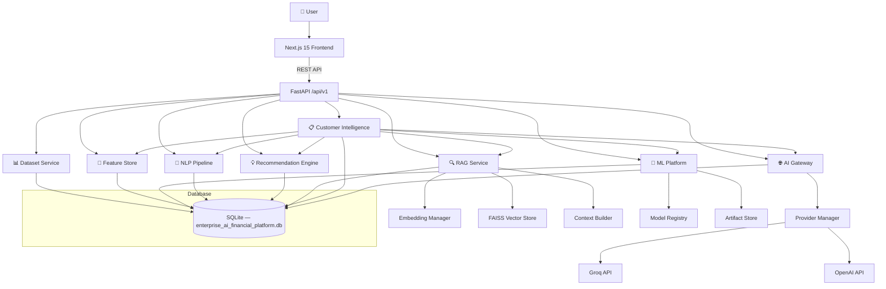
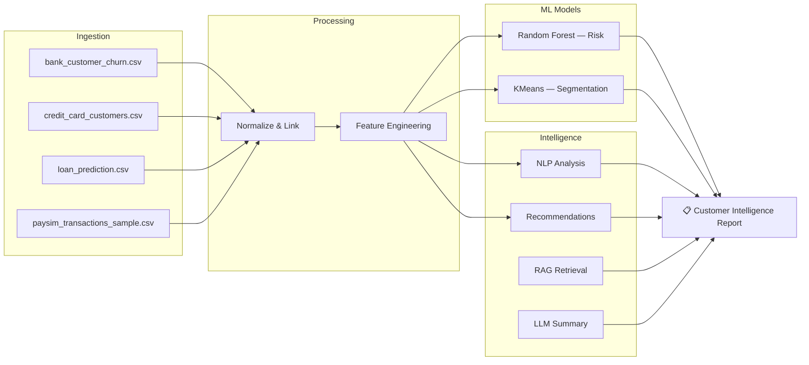
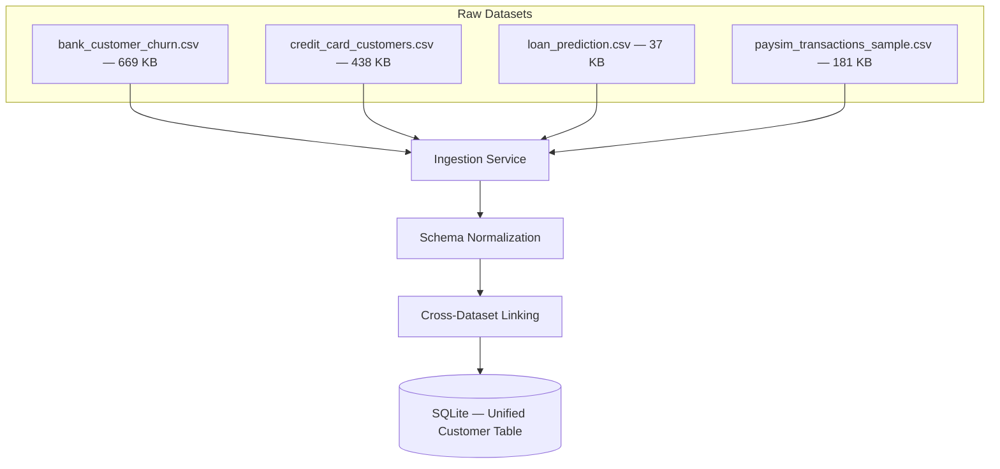
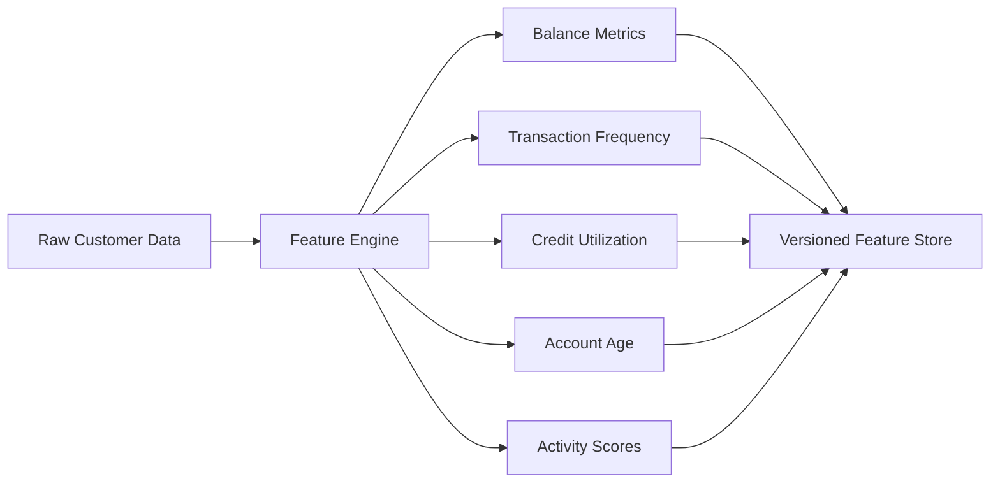
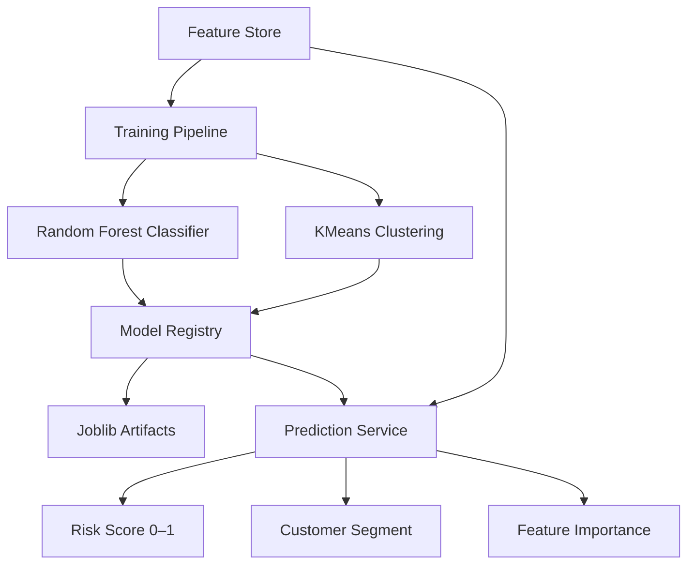
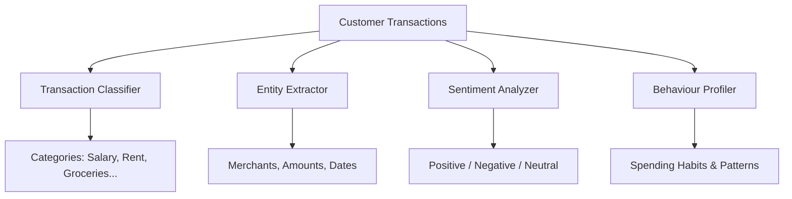
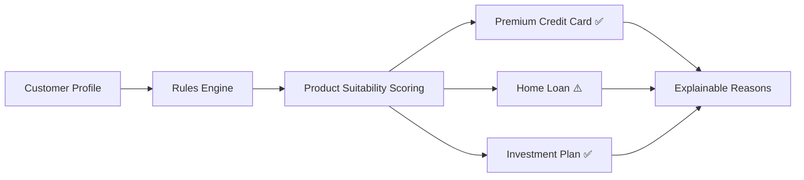
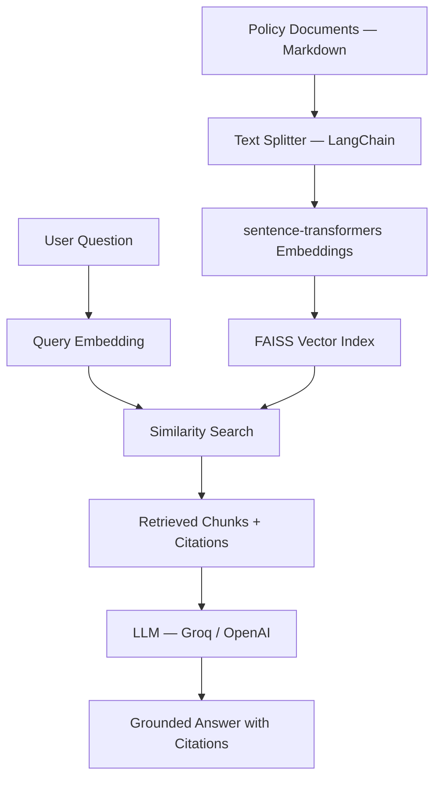
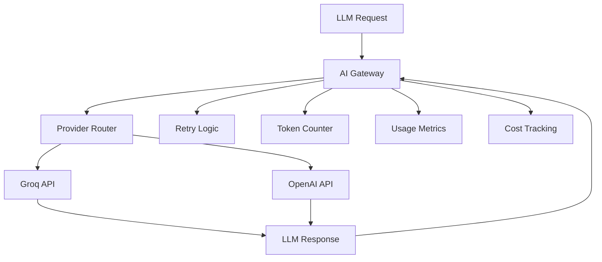

# 📚 Enterprise AI Financial Customer Intelligence Platform — Project Overview

Local, interview-ready AI platform that composes machine learning, NLP, RAG, explainable AI, and provider-abstracted LLM integration into a unified financial customer intelligence system.

## How It Works

Given a **Customer ID**, the platform orchestrates 7 services to generate a **Customer Intelligence Report**:

1. **Canonical Data** — normalized from four public financial datasets into one schema
2. **Feature Store** — deterministic, versioned customer features
3. **ML Predictions** — Random Forest risk scoring and KMeans segmentation
4. **NLP Intelligence** — transaction classification, entity extraction, sentiment, and behaviour profiling
5. **Recommendation Engine** — rules-based product suitability scoring with explainable reasons
6. **RAG Retrieval** — policy document search with FAISS indexing and grounded citations
7. **AI Gateway** — provider-abstracted LLM call through Groq or OpenAI with retry, metrics, and token accounting

---

## 🏗️ System Architecture



---

## 🔄 Data Flow Pipeline



---

## 🧩 Component Breakdown

### 📊 Dataset Service — Data Ingestion & Normalization



---

### 🧮 Feature Store — Feature Engineering



---

### 🤖 ML Platform — Training & Prediction



---

### 📝 NLP Pipeline — Transaction Intelligence



---

### 💡 Recommendation Engine



---

### 🔍 RAG Service — Retrieval Augmented Generation



---

### 🌐 AI Gateway — Provider Abstraction



---

## 🛠️ Technology Stack

| Layer | Technologies |
|-------|-------------|
| **Frontend** | Next.js 15, TypeScript, Tailwind CSS, shadcn/ui, TanStack Query, Recharts |
| **Backend** | FastAPI, SQLAlchemy 2.x, Alembic, Pydantic Settings |
| **ML** | scikit-learn, pandas, numpy, joblib |
| **NLP** | Deterministic Python (rules-based classification, extraction, sentiment) |
| **RAG** | FAISS, sentence-transformers, LangChain text splitters |
| **AI Providers** | Groq, OpenAI (via OpenAI-compatible HTTP adapter) |
| **Database** | SQLite (20 tables) |
| **HTTP Client** | httpx |

---

## 📂 Project Structure

```
enterprise-ai-financial-platform/
  backend/                 # FastAPI application
    app/
      api/v1/              # 45 versioned REST endpoints
      core/                # Configuration, logging
      db/                  # SQLAlchemy engine, session, base
      datasets/            # Dataset ingestion, normalization, linking
      feature_store/       # Deterministic feature engineering
      gateway/             # AI Gateway, metrics, retry, routing
      intelligence/        # Customer Intelligence reports
      ml/                  # Training, prediction, registry, explainability
      models/              # SQLAlchemy ORM models (20 tables)
      nlp/                 # Transaction classification, entities, sentiment
      prompts/             # File-backed prompt templates
      providers/           # Groq, OpenAI, provider abstraction
      rag/                 # Embeddings, vector store, retrieval, chat
      recommendation/      # Rules-based product recommendations
      schemas/             # Pydantic request/response schemas
    tests/                 # Integration tests
  frontend/                # Next.js 15 application
    app/                   # 17 pages (App Router)
    components/            # Reusable UI components
    hooks/                 # Custom React hooks
    lib/                   # API client, utilities
    types/                 # TypeScript type definitions
  data/                    # Raw datasets, processed data, policy documents
  models/                  # Versioned ML artifacts (joblib)
  vectorstore/             # FAISS index and knowledge records
  docs/                    # Architecture and design documentation
  scripts/                 # Development and verification scripts
```

---

## 🚀 Quick Start

```bash
# Cross-platform setup
python scripts/setup_environment.py
python scripts/run_backend.py     # Terminal 1
python scripts/run_frontend.py    # Terminal 2

# Ingest data & train models
curl -X POST http://127.0.0.1:8000/api/v1/datasets/ingest
curl -X POST http://127.0.0.1:8000/api/v1/ml/train/risk
curl -X POST http://127.0.0.1:8000/api/v1/ml/train/segmentation
curl -X POST http://127.0.0.1:8000/api/v1/knowledge/ingest
```

Open `http://localhost:3000` to access the platform.

---

## 🎯 Key Interview Topics Covered

- ✅ Full-stack development (Next.js + FastAPI)
- ✅ Machine Learning (Random Forest, KMeans, scikit-learn)
- ✅ NLP (text classification, entity extraction, sentiment analysis)
- ✅ RAG (Retrieval Augmented Generation with FAISS)
- ✅ LLM integration (Groq/OpenAI with provider abstraction)
- ✅ Data engineering (ETL, normalization, feature engineering)
- ✅ API design (45 RESTful endpoints, versioned)
- ✅ Database design (20 SQLite tables, SQLAlchemy ORM)
- ✅ Explainable AI (feature importance, confidence scores, citations)
- ✅ Software architecture (service pattern, provider abstraction, gateway)
