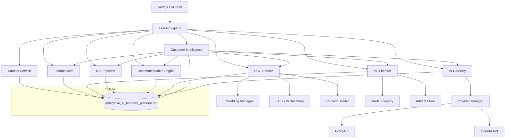

# Enterprise AI Financial Customer Intelligence Platform

Local, interview-ready AI platform that composes machine learning, NLP, RAG, explainable AI, and provider-abstracted LLM integration into a unified financial customer intelligence system.

## What This Project Does

Given a customer ID, the platform generates a **Customer Intelligence Report** by orchestrating:

1. **Canonical data** — normalized from four public financial datasets into one schema.
2. **Feature store** — deterministic, versioned customer features.
3. **ML predictions** — Random Forest risk scoring and KMeans segmentation.
4. **NLP intelligence** — transaction classification, entity extraction, sentiment, and behaviour profiling.
5. **Recommendation engine** — rules-based product suitability scoring with explainable reasons.
6. **RAG retrieval** — policy document search with FAISS indexing and grounded citations.
7. **AI Gateway** — provider-abstracted LLM call through Groq or OpenAI with retry, metrics, and token accounting.

The final report includes structured evidence, citations, confidence scores, feature importance, workflow tracing, and exports to PDF/Markdown/JSON.

## Architecture



## Technology Stack

| Layer | Technologies |
|-------|-------------|
| Frontend | Next.js 15, TypeScript, Tailwind CSS, shadcn/ui, TanStack Query, Recharts |
| Backend | FastAPI, SQLAlchemy 2.x, Alembic, Pydantic Settings |
| ML | scikit-learn, pandas, numpy, joblib |
| NLP | Deterministic Python (rules-based classification, extraction, sentiment) |
| RAG | FAISS, sentence-transformers, LangChain text splitters |
| AI Providers | Groq, OpenAI (via OpenAI-compatible HTTP adapter) |
| Database | SQLite |
| HTTP Client | httpx |

## Quick Start

**Cross-platform (recommended):**

```bash
python scripts/setup_environment.py
python scripts/run_backend.py     # Terminal 1
python scripts/run_frontend.py    # Terminal 2
```

**Manual (macOS / Linux):**

```bash
# 1. Clone and configure
cp .env.example .env
# Edit .env and set AI_GROQ_API_KEY

# 2. Backend
cd backend
python3 -m venv .venv
source .venv/bin/activate
pip install -e ".[dev]"
uvicorn app.main:app --reload

# 3. Frontend (separate terminal)
cd frontend
npm install
npm run dev
```

**Manual (Windows PowerShell):**

```powershell
copy .env.example .env
# Edit .env and set AI_GROQ_API_KEY

cd backend
python -m venv .venv
.venv\Scripts\Activate.ps1
pip install -e ".[dev]"
uvicorn app.main:app --reload

# Separate terminal
cd frontend
npm install
npm run dev
```

After both servers are running:

```bash
# 4. Ingest datasets, train models, index knowledge
curl -X POST http://127.0.0.1:8000/api/v1/datasets/ingest
curl -X POST http://127.0.0.1:8000/api/v1/ml/train/risk
curl -X POST http://127.0.0.1:8000/api/v1/ml/train/segmentation
curl -X POST http://127.0.0.1:8000/api/v1/knowledge/ingest
```

Open `http://localhost:3000` to access the platform.

See [docs/platform_compatibility.md](docs/platform_compatibility.md) for detailed Windows and macOS setup.

## Project Structure

```text
enterprise-ai-financial-platform/
  backend/             # FastAPI application
    app/
      api/v1/          # 45 versioned REST endpoints
      core/            # Configuration, logging
      db/              # SQLAlchemy engine, session, base
      datasets/        # Dataset ingestion, normalization, linking
      feature_store/   # Deterministic feature engineering
      gateway/         # AI Gateway, metrics, retry, routing
      intelligence/    # Customer Intelligence reports, context builder
      ml/              # Training, prediction, registry, explainability
      models/          # SQLAlchemy ORM models (20 tables)
      nlp/             # Transaction classification, entities, sentiment, behaviour
      prompts/         # File-backed prompt templates
      providers/       # Groq, OpenAI, provider abstraction
      rag/             # Embeddings, vector store, retrieval, chat
      recommendation/  # Rules-based product recommendations
      schemas/         # Pydantic request/response schemas
    tests/             # Integration tests by phase
  frontend/            # Next.js 15 application
    app/               # 17 pages (App Router)
    components/        # Reusable UI components
    hooks/             # Custom React hooks
    lib/               # API client, utilities
    types/             # TypeScript type definitions
  data/                # Raw datasets, processed data, policy documents
  models/              # Versioned ML artifacts (joblib)
  vectorstore/         # FAISS index and knowledge records
  docs/                # Architecture and design documentation
  scripts/             # Development and verification scripts
```

## API Surface

| Domain | Endpoints | Key Routes |
|--------|-----------|------------|
| Health | 2 | `GET /health`, `GET /system-health` |
| Datasets | 3 | `POST /datasets/ingest`, `GET /datasets/status` |
| Customers | 3 | `GET /customers`, `GET /customers/{id}`, `GET /customers/{id}/features` |
| ML | 9 | `POST /ml/train/risk`, `POST /ml/predict/risk`, `GET /ml/models` |
| Intelligence | 6 | `GET /transactions/{id}/insights`, `GET /customers/{id}/behaviour` |
| Recommendations | 3 | `POST /recommendations/generate/{id}`, `GET /recommendation-rules` |
| Knowledge | 3 | `POST /knowledge/ingest`, `GET /knowledge/documents` |
| Chat | 3 | `POST /chat`, `GET /chat/sessions` |
| Providers | 5 | `GET /providers`, `POST /providers/switch`, `GET /providers/status` |
| Customer Intelligence | 5 | `POST /customers/{id}/intelligence-report`, `GET /intelligence/showcase-metrics` |
| Prompts | 2 | `GET /prompts`, `GET /prompts/{name}` |
| Settings | 1 | `GET /settings/ai-processing` |

All endpoints are prefixed with `/api/v1`.

## Documentation

Detailed documentation is in the [docs/](docs/) directory:

- [Architecture](docs/architecture.md) — system design and component overview
- [Architecture Decisions](docs/architecture_decisions.md) — design rationale and trade-offs
- [API Reference](docs/api_reference.md) — endpoint details
- [Database Schema](docs/database.md) — all 20 SQLite tables
- [AI Gateway](docs/ai_gateway.md) — LLM request routing and metrics
- [Provider Architecture](docs/provider_architecture.md) — runtime provider switching
- [RAG Pipeline](docs/rag_pipeline.md) — policy retrieval and citations
- [Machine Learning](docs/machine_learning.md) — training, prediction, registry
- [NLP Pipeline](docs/nlp_pipeline.md) — transaction intelligence
- [Recommendation Engine](docs/recommendation_engine.md) — rules-based scoring
- [Customer Intelligence](docs/customer_intelligence.md) — report orchestration
- [Demo Guide](docs/demo_guide.md) — interview walkthrough
- [Project Metrics](docs/project_metrics.md) — repository statistics
- [Known Limitations](docs/known_limitations.md) — scope and future work

## Development

```bash
# Backend
cd backend
ruff check .              # Lint
black --check .           # Format check
mypy app                  # Type check
pytest tests/ -v          # Tests

# Frontend
cd frontend
npm run lint              # ESLint
npm run typecheck         # TypeScript
npm run build             # Production build
```

## License

This project is a local technical showcase for interview demonstration purposes.
