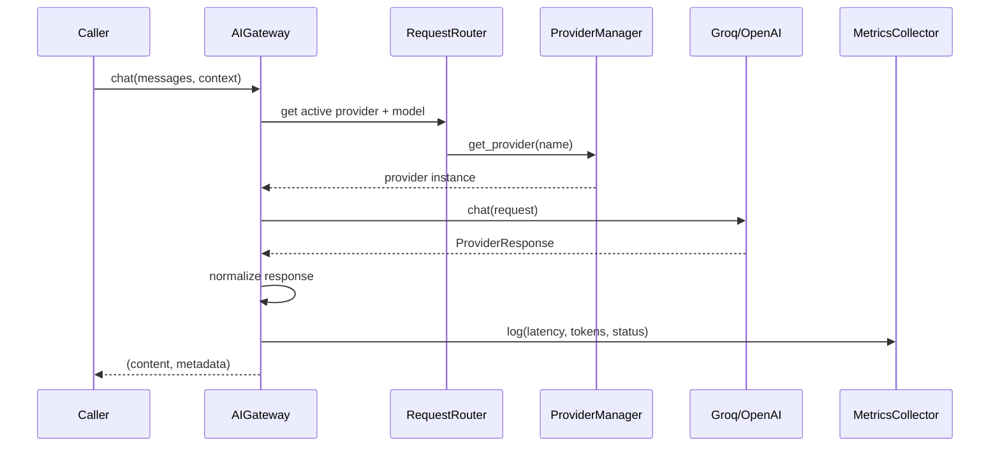

# AI Gateway

The AI Gateway is the only path from business services to LLM providers. No service calls Groq or OpenAI directly.

## Components

| Component | File | Responsibility |
|-----------|------|---------------|
| `AIGateway` | `gateway/ai_gateway.py` | Public entry point for LLM requests |
| `RequestRouter` | `gateway/router.py` | Selects the active provider from SQLite settings |
| `ResponseNormalizer` | `gateway/response.py` | Converts provider responses into a common shape |
| `MetricsCollector` | `gateway/metrics.py` | Persists latency, tokens, chunk counts to `ai_metric_logs` |
| `RetryPolicy` | `gateway/retry.py` | Retries transient provider errors |
| `StreamingAdapter` | `gateway/streaming.py` | Delegates streaming through the provider interface |
| `TokenAccounting` | `gateway/token_accounting.py` | Estimates tokens when providers omit usage data |

## Request Lifecycle

## Error Handling

- If the provider returns a transient error, `RetryPolicy` retries up to 3 times with exponential backoff.
- If the provider is not configured (missing API key), the gateway returns a descriptive error without retrying.
- If all retries fail, the caller receives a structured error. The Customer Intelligence service falls back to a deterministic grounded narrative.

## Scope

The gateway explains or summarizes retrieved and structured data. It does not make lending, investment, insurance, or product decisions.
