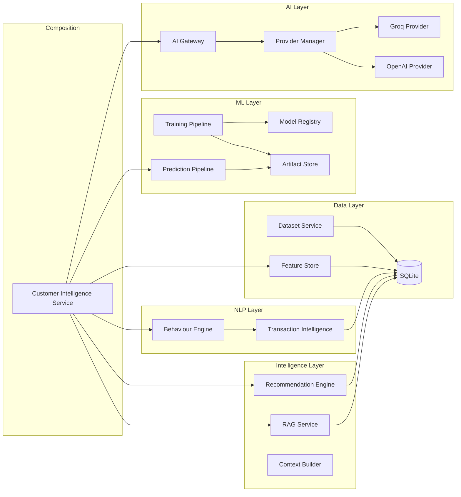
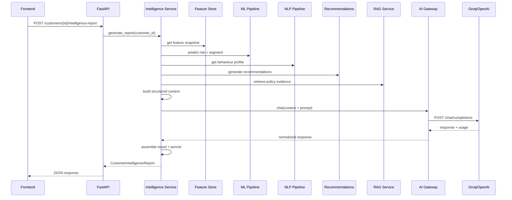

# Architecture

## System Overview

The platform is a modular AI system where each layer builds on the previous:

```text
Data Foundation → Feature Store → ML → NLP → Recommendations → RAG → AI Gateway → Customer Intelligence
```

No layer calls downstream. The Customer Intelligence service is the only component that composes all prior layers.

## Component Diagram



## Request Flow

A Customer Intelligence Report follows this sequence:



## Key Design Principles

- **Separation of concerns** — each module has a single responsibility.
- **Evidence-grounded AI** — the LLM summarizes structured evidence, never invents data.
- **Provider abstraction** — business logic never calls Groq or OpenAI directly.
- **Deterministic foundations** — ML, NLP, and recommendations are deterministic and reproducible.
- **Local-first** — everything runs on SQLite with no external services except the LLM API.

## Module Boundaries

| Module | Responsibility | Depends On |
|--------|---------------|------------|
| `datasets/` | Ingest, normalize, link public CSV data | `db/`, `core/` |
| `feature_store/` | Compute versioned customer features | `db/`, `datasets/` |
| `ml/` | Train models, predict, registry, explainability | `db/`, `feature_store/` |
| `nlp/` | Transaction classification, sentiment, behaviour | `db/` |
| `recommendation/` | Rules-based product scoring | `db/`, `nlp/` |
| `rag/` | Policy ingestion, embeddings, retrieval, chat | `db/`, `gateway/` |
| `gateway/` | AI request routing, metrics, retry | `providers/` |
| `providers/` | Groq/OpenAI adapters, health checks | External APIs |
| `intelligence/` | Customer Intelligence report composition | All above |
| `prompts/` | File-backed prompt templates | Filesystem |
