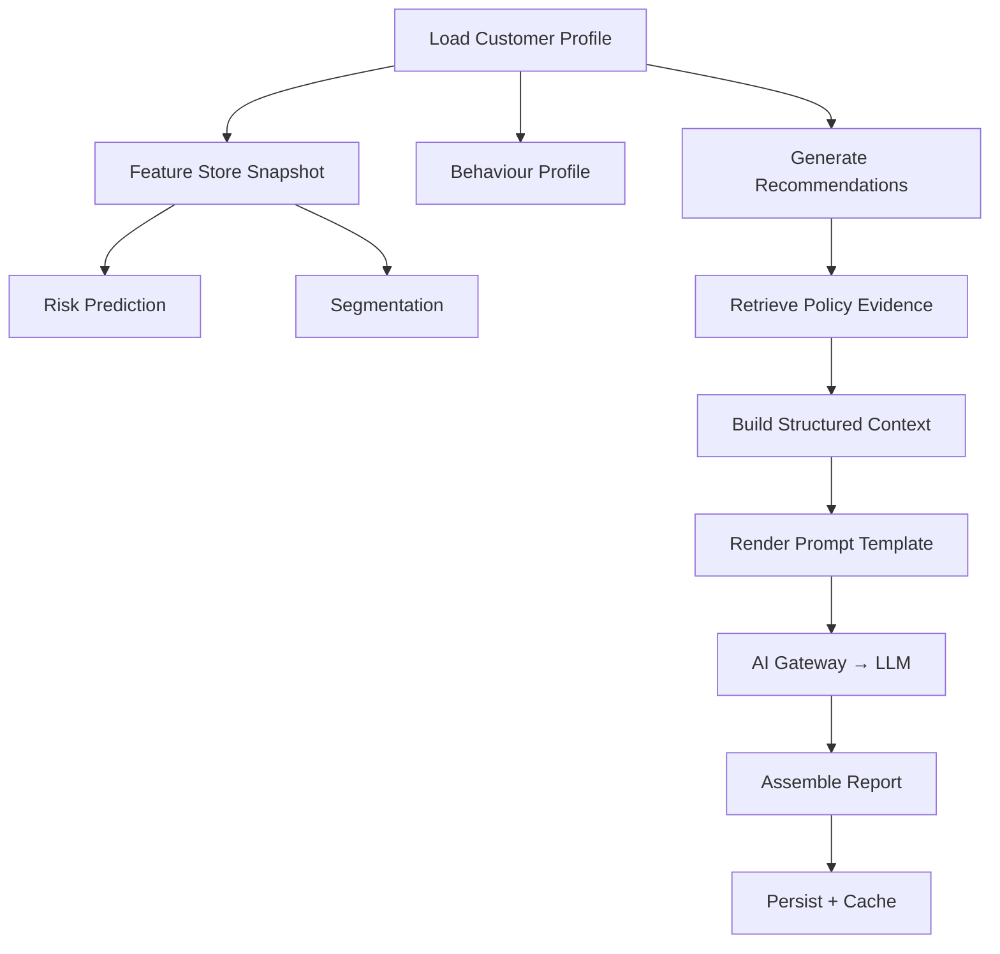

# Customer Intelligence Platform

The Customer Intelligence service is the composition layer that orchestrates all prior services into a single report.

## Workflow

Each stage is recorded in the workflow trace with timing, source, and status.

## Request Lifecycle

1. Load the canonical customer profile from SQLite.
2. Read the latest feature snapshot from the feature store.
3. Run the active risk prediction model.
4. Run the active segmentation model.
5. Generate behaviour profile from transaction intelligence.
6. Generate rules-based product recommendations.
7. Retrieve policy evidence from the knowledge base.
8. Build a structured context payload with all evidence.
9. Render the `customer_intelligence_report` prompt template.
10. Send the rendered prompt through the AI Gateway.
11. Assemble the final report with structured evidence and AI narrative.
12. Persist the report, evidence, workflow trace, and metrics.

## Grounding Rules

The LLM summarizes structured evidence only. It does not invent data, make financial decisions, or recommend products independently. If provider credentials are not configured, the service returns a deterministic grounded fallback narrative built from the structured evidence.

## Cache Strategy

Reports are cached by `input_hash`, which is computed from:
- Customer metadata and feature version
- Active model versions
- Behaviour profile timestamp
- Recommendation set
- Citation set
- Provider, model, and report version

A `force_regenerate` flag bypasses the cache.

## Exports

Reports can be exported as:
- **JSON** — full structured report with all evidence
- **Markdown** — formatted narrative with citations
- **PDF** — rendered via HTML-to-PDF conversion

Each export preserves policy citations and report metadata for auditability.
