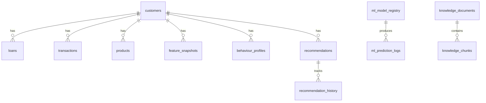

# Database Schema

All data is stored in a single SQLite file at `data/enterprise_ai_financial_platform.db`. Tables are created automatically by SQLAlchemy on startup.

## Table Overview

| Table | Purpose | Key Columns |
|-------|---------|-------------|
| `customers` | Canonical customer profiles | `customer_id` (PK), demographics, credit, income |
| `loans` | Loan records linked to customers | `customer_id` (FK), type, amount, status |
| `transactions` | Transaction records | `customer_id` (FK), type, amount, description |
| `products` | Financial products held | `customer_id` (FK), type, credit limit, balance |
| `feature_snapshots` | Versioned feature vectors | `customer_id` (FK), `feature_version`, JSON features |
| `dataset_metadata` | Ingested dataset tracking | `dataset_name` (PK), rows, checksum, version |
| `ingestion_runs` | Dataset ingestion history | dataset, status, rows processed |
| `ml_model_registry` | Trained model metadata | name, version, metrics, artifact path, active flag |
| `ml_prediction_logs` | Prediction audit trail | model, customer, prediction, confidence |
| `transaction_insights` | NLP-processed transactions | entities, category, sentiment, keywords |
| `behaviour_profiles` | Per-customer behaviour summaries | spend patterns, lifestyle, flags |
| `recommendation_rules` | Product recommendation rules | conditions, base score, version |
| `recommendations` | Generated recommendations | customer, product, score, explanation |
| `recommendation_history` | Recommendation lifecycle events | action, details |
| `ai_provider_settings` | Runtime AI configuration | provider, model, temperature, thresholds |
| `provider_switch_events` | Provider change audit log | previous/new provider and model |
| `ai_metric_logs` | Gateway request metrics | latency, tokens, status, operation |
| `knowledge_documents` | Indexed policy documents | name, checksum, chunk count |
| `knowledge_chunks` | Document chunks for retrieval | content, section, embedding metadata |
| `chat_sessions` | Chat conversation sessions | session ID, provider, model |
| `chat_messages` | Chat messages with context | role, content, citations, token usage |
| `customer_intelligence_reports` | Cached intelligence reports | report JSON, evidence, workflow trace |

## Relationships

## Design Notes

- All tables use `created_at` timestamps with UTC timezone.
- `utc_now()` in `models/canonical.py` is the shared timestamp function.
- Feature snapshots use composite uniqueness: `(customer_id, feature_version, dataset_version)`.
- The `ai_provider_settings` table is a singleton row (id=1) for runtime configuration.
- Intelligence reports are cached by `input_hash` to avoid redundant LLM calls.
