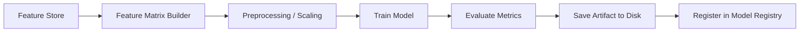

# Machine Learning Platform

The ML layer trains, versions, and serves two model types on top of the canonical data foundation.

## Models

| Model | Algorithm | Target | Output |
|-------|-----------|--------|--------|
| Risk Prediction | Random Forest Classifier | Churn / attrition risk | Risk level (Low/Medium/High) + confidence |
| Customer Segmentation | KMeans Clustering | Customer grouping | Segment label + cluster assignment |

## Feature Matrix

Both models share 8 engineered features from the feature store:

| Feature | Source | Description |
|---------|--------|-------------|
| `age` | Customer profile | Customer age |
| `credit_score` | Customer profile | Credit score |
| `estimated_income` | Customer profile | Estimated annual income |
| `savings_balance` | Customer profile | Savings account balance |
| `tenure_months` | Customer profile | Relationship duration |
| `total_loan_amount` | Loan aggregation | Sum of active loan amounts |
| `product_count` | Product aggregation | Number of held products |
| `savings_ratio` | Derived | savings_balance / estimated_income |

Missing values are imputed with column medians. Features are standardized using `StandardScaler`.

## Training Pipeline

Training is triggered via `POST /api/v1/ml/train/risk` or `POST /api/v1/ml/train/segmentation`. Each training run creates a versioned artifact on disk and a registry entry in SQLite.

## Model Registry

Each registered model stores:
- Model name, version, algorithm
- Training metrics (accuracy, precision, recall, F1, or silhouette score)
- Feature list and versions
- Artifact path (joblib file)
- Dataset version and feature version
- Active flag (only one active model per name)
- Training time

## Explainability

Risk predictions include feature importance from the Random Forest's `feature_importances_` array. The prediction response includes:
- Top contributing features ranked by importance
- Individual feature values for the predicted customer
- Confidence score and risk level mapping
