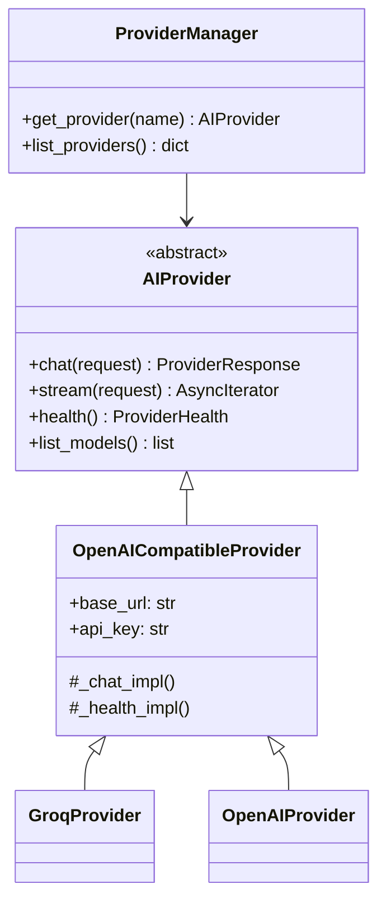

# Provider Architecture

All providers implement the `AIProvider` interface defined in `providers/base.py`:

- `chat(request) → ProviderResponse` — send a chat completion request
- `stream(request) → AsyncIterator[str]` — stream a response
- `health() → ProviderHealth` — check connectivity and status
- `list_models() → list[str]` — list available models

## Class Hierarchy



`OpenAICompatibleProvider` handles HTTP calls via httpx, response parsing, and model listing. `GroqProvider` and `OpenAIProvider` only set the base URL and default models.

## Runtime Switching

Provider and model are stored in the `ai_provider_settings` SQLite table. Switching is done via:

```
POST /api/v1/providers/switch
{"provider": "groq", "model": "llama-3.3-70b-versatile"}
```

The `RequestRouter` reads the current setting on each request. No restart required.

## Health Check

Each provider's `health()` calls `list_models()` against the real API. The result returns:
- `status`: `healthy`, `unhealthy`, or `not_configured`
- `latency_ms`: round-trip time
- `model_count`: number of available models
- `error`: error message if unhealthy

## Placeholder Providers

`GeminiProvider`, `OllamaProvider`, and `AnthropicProvider` are stubs in `providers/placeholders.py`. They return `not_configured` and exist to demonstrate the abstraction pattern.
