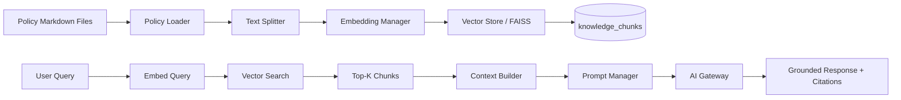

# RAG Pipeline

The RAG pipeline provides grounded policy retrieval for chat and intelligence reports.

## Pipeline

## Ingestion

1. **Policy Loader** (`rag/policy_loader.py`) — reads Markdown files from `data/policies/`.
2. **Text Splitter** (`rag/splitter.py`) — splits documents by section headers using LangChain's `RecursiveCharacterTextSplitter`.
3. **Embedding Manager** (`rag/embeddings.py`) — encodes chunks with `sentence-transformers/all-MiniLM-L6-v2`. Falls back to deterministic local hashing if sentence-transformers is not installed.
4. **Vector Store** (`rag/vectorstore.py`) — indexes embeddings with FAISS. Falls back to NumPy cosine similarity if FAISS is not installed.
5. All chunks and metadata are persisted to `knowledge_chunks` and `knowledge_documents` tables.

## Retrieval

Given a user query, the RAG service:
1. Embeds the query using the same embedding model.
2. Searches the vector store for the top-K most similar chunks.
3. Filters results below the similarity threshold.
4. Builds a context string with chunk content and source metadata.
5. Passes the context to the prompt manager and AI Gateway.

## Citations

Every response includes citations with:
- `document` — source filename
- `section` — document section header
- `chunk` — chunk index
- `similarity_score` — cosine similarity to the query

If no retrieved evidence meets the threshold, the assistant returns: *"Insufficient supporting documentation."*

## Chat Memory

Chat sessions are stored in `chat_sessions` and `chat_messages`. The conversation memory window is configurable (`conversation_memory` setting). Previous messages are included as context for multi-turn conversations.

## Policy Documents

| Document | Topics |
|----------|--------|
| `banking_faq.md` | Account types, fees, digital banking |
| `credit_card_policy.md` | Eligibility, limits, rewards |
| `home_loan_policy.md` | DTI requirements, documentation, rates |
| `insurance_policy.md` | Products, suitability, claims |
| `investment_guide.md` | Risk profiles, product types, regulation |
